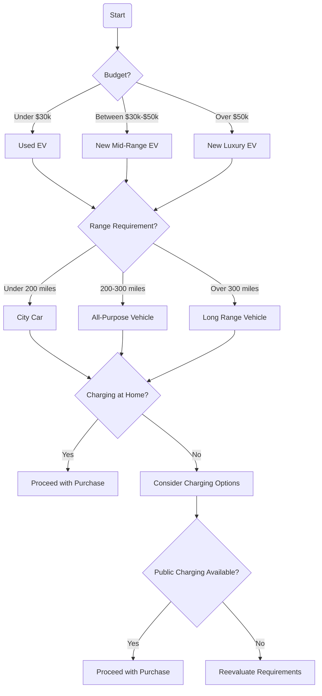
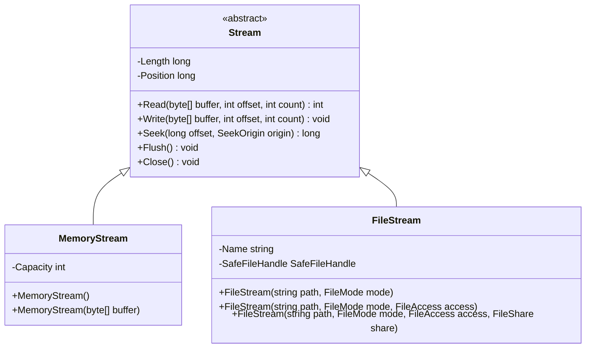

## Generating documentation using DocFX

DocFX is installed as a dotnet CLI global tool. Let's do that now and configure the class library project to generate a documentation XML file from the source code

```
dotnet tool install -g docfx
# Or
dotnet tool update -g docfx

dotnet tool list -g
```

```
<PropertyGroup>
  <TargetFramework>net8.0</TargetFramework>
  <ImplicitUsings>enable</ImplicitUsings>
  <Nullable>enable</Nullable>
  <TreatWarningsAsErrors>true</TreatWarningsAsErrors>
  <GenerateDocumentationFile>true</GenerateDocumentationFile>
  <DocumentationFile>
    bin\$(Configuration)\$(TargetFramework)\$(AssemblyName).xml
  </DocumentationFile>
</PropertyGroup>
```


**Creating a DocFX project**

```
docfx init
```

```
Name (mysite): PacktLibrary
Generate .NET API documentation? [y/n] (y): y
.NET projects location (src): PacktLibrary
Markdown docs location (docs): docs
Enable site search? [y/n] (y): y
Enable PDF? [y/n] (y): y
Is this OK? [y/n] (y): y
```

```
docfx docfx.json --serve
```


**Adding custom documentation content**

```
- name: Introduction
  href: introduction.md
- name: Getting Started
  href: getting-started.md
```


**Documenting a Minimal APIs service using OpenAPI**

```
<GenerateDocumentationFile>true</GenerateDocumentationFile>
```

```
builder.Services.AddSwaggerGen(c =>
{
  c.SwaggerDoc("v1", new OpenApiInfo { Title = "Northwind API", Version = "v1" });
    
  // Set the comments path for the Swagger JSON and UI.
  string xmlFile = $"{Assembly.GetExecutingAssembly().GetName().Name}.xml";
  string xmlPath = Path.Combine(AppContext.BaseDirectory, xmlFile);
  c.IncludeXmlComments(xmlPath);
});
```

```
<Project Sdk="Microsoft.NET.Sdk.Web">
  <PropertyGroup>
    <TargetFramework>net8.0</TargetFramework>
    <Nullable>enable</Nullable>
    <ImplicitUsings>enable</ImplicitUsings>
    <InvariantGlobalization>false</InvariantGlobalization>
    <TreatWarningsAsErrors>true</TreatWarningsAsErrors>
    <NoWarn>CS9057</NoWarn>
  </PropertyGroup>
  <ItemGroup>
    <PackageReference Include="Microsoft.AspNetCore.OpenApi" Version="8.0.1" />
    <PackageReference Include="Swashbuckle.AspNetCore" Version="6.5.0" />
  </ItemGroup>
</Project>
```


**Documenting visually with Mermaid diagrams**

```mermaid

```

```
npm install -g @mermaid-js/mermaid-cli
```

*Flowcharts using Mermaid*



*Class diagrams using Mermaid*




**Converting Mermaid to SVG**

```
mmdc -i mermaid-examples.md -o output.md
```